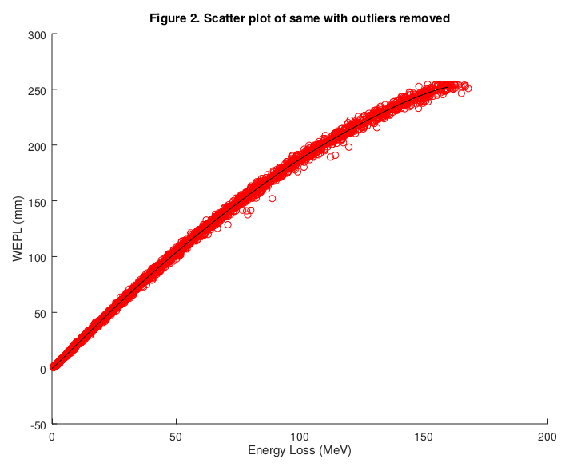

# The pCT simulator in TOPAS
This project is an implementation of the pCT aparatus in [TOPAS](http://www.topasmc.org/) . As such, you will need a TOPAS license. In addition, you will also need either [MATLAB](https://www.mathworks.com/products/matlab.html) or [GNU Octave](https://www.gnu.org/software/octave/). (Octave is a free, incomplete implementation of an old version of matlab.) The apparatus is very simplified. Instead of the calorimeter, it uses the energy values of the phase space outputs at the 4 T-V detectors to determine the energy loss of each proton as it passes through the phantom. For those who require a more realistic simulator, please use the stripified branch of [Geant4](https://github.com/pCT-collaboration/Geant4).
## Directories
original_pCT
: This directory contains the original TOPAS simulator code supplied by Pierluigi Piersimoni. It is included to preserve this code.

pCTextensions
: This directory contains a TOPAS scorer extension for an earlier version of TOPAS. It was also supplied by Pierluigi Piersimoni and is included here to preserve this code.

pCT
: This directory contains the working simulator, calibration and preprocessing tools.
## Calibration
#### Note: It is not necessary to perform this step. Default calibration files have already been created.
Each proton event in a phase space file contains the energy of the proton when it passes through one of the T-V detectors. Subtracting the energies between detectors 2 and 3, we get the energy lost as the proton passed through the phantom. We need to convert the energy lost to the water equivalent path length (WEPL). To do that, we do 5 calibration runs with a known phantom. The first run uses a wedge consisting of water. (Not very realistic, but Geant4 does not require that water is in a container.) Each successive run adds a water brick to the phantom. The command to generate the calibration data is:

	Usage: ./Calibration.sh
	    --dir=<output directory>
	    [--width=<width of detector in mm>]
	    [--height=<height of detector in mm>]
	    [--pdensity=<number of protons / mm^2>]

The output directory is the only required parameter. width and height default to 349 mm and 86.2 mm, respectively. pdensity is the number of protons / mm^2.  The total number of protons is the product of width * height * pdensity truncated to an integer. 
For each proton in the phase space outputs, we have the T-U-V coordinates of the proton as it passes through the first and second detectors. Projecting the line passing throught those two points to the phantom we get the coordinates where the proton entered the phantom. Similarly, projecting the line connecting the T-U-V coordinates of the proton as it passes through the third and fourth detectors we get the coordinates of where the proton exits the phantom. The straight line distance (not MLP) between these two points is the water equivalent path length (WEPL) of the proton and the difference of the proton's energy between the second and third detectors is the energy loss. We record these values for a "large" number of protons, say 500 protons for each of the 5 calibration runs for a total of 2500 protons. We then do a least squares fit with a 7th degree poynomial. Figure 1 is an example of this output. Figure 2 is the same plot except the outliers have been removed.The output of calibratin is three files (the output of polyfit), P.mat, S.mat, and Mu.mat.  These are required for preprocessing.

 
 
## Visualization
When adding a new phantom, it is useful to see the phantom inside the apparatus. Modify the Run.topas file changing the last line to refer to your new TOPAS phantom. (I like to name the TOPAS input files with the extension *.topas instead of *.txt to remind me that the file is TOPAS input.) You might also like to modify the two phantom angles to rotate the phantom, and finally you might want to modify View.topas to use OenGL instead of HepRep. Then, to see the phantom, run the command:

    $ topas Run.topas
    
## Running the simulator

	Usage: ./Generate.sh
	    --phantom=[WaterPhantom|CTP404]
	    --dir=<output directory>
	    [--preparer=<name of preparer>]
	    [--width=<width of detector in mm>]
	    [--height=<height of detector in mm>]
	    [--pdensity=<number of protons / mm^2>]
	    [--nproj=<number of projections>]
	    [--start=<start angle>]
	    [--incr=<angle increment>]

The Generate.sh script will generate phase space event data for the chosen phantom (currently only the water and CTP404 phantoms are available) and put the outputs under the named output directory. The other parameters are optional and have defaults. The preparer parameter is not used in this step. It is present so that the Generate.sh and Preprocessing.sh commands have identical parameter lists. width and height default to 349 mm and 86.2 mm, respectively. pdensity is the number of protons / mm^2.  The total number of protons per projection is the product of width * height * pdensity truncated to an integer. nproj is the number of projections to generate starting and the start angle and incrementing by incr. nproj defaults to 1, start defaults to 0, and incr defaults to 4.
The output of each projection is generated in <output directory>/<angle>. 16 pairs of phase space files are generated for each projection. These need to be converted into the format required by the reconstruction program by the preprocessing step described below.
An example run to generate 90 projections of the CTP404 phantom at 4 degree increments with 200 protons / mm^2 is:

	`./Generate.sh --phantom=CTP404 --dir=/home/Reconstructions/topas --pdensity=200 --nproj=90`
## Preprocessing

	Usage: ./Preprocessing.sh
	    --phantom=[WaterPhantom|CTP404]
	    --dir=<output directory>
	    [--preparer=<name of preparer>]
	    [--width=<width of detector in mm>]
	    [--height=<height of detector in mm>]
	    [--pdensity=<number of protons / mm^2>]
	    [--nproj=<number of projections>]
	    [--start=<start angle>]
	    [--incr=<angle increment>]

The Preprocessing.sh script converts the phase space event data of the Generate step above into projection data in the format expected by the reconstruction program. It has the same parameter list as the Generate,sh script. Here, width, height, and pdensity are unused. phantom, dir, nproj, start, and incr must be the same as that used in the Generate.sh script so that the program can find the phase space event data. If preparer is not specified, it is extracted from the /etc/passwd file.
## Reconstruction
TBD
